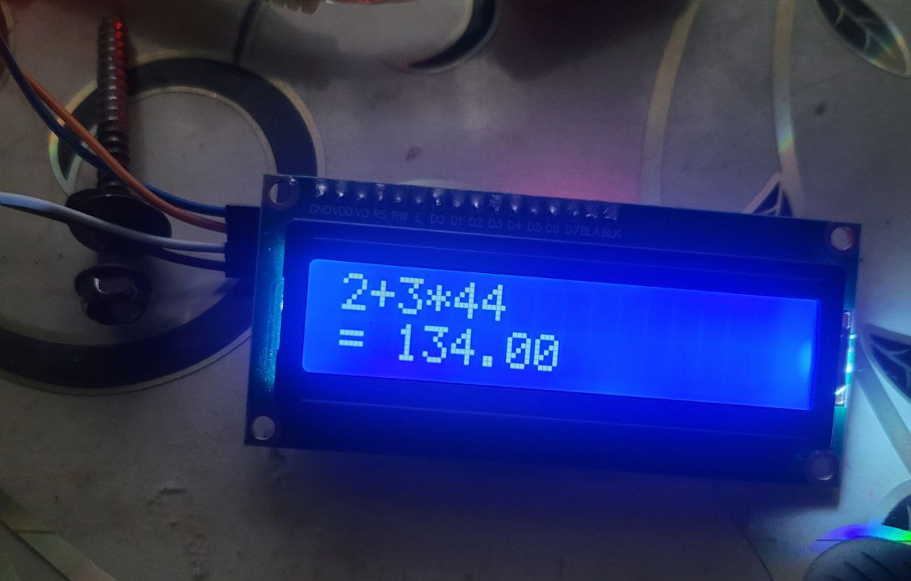
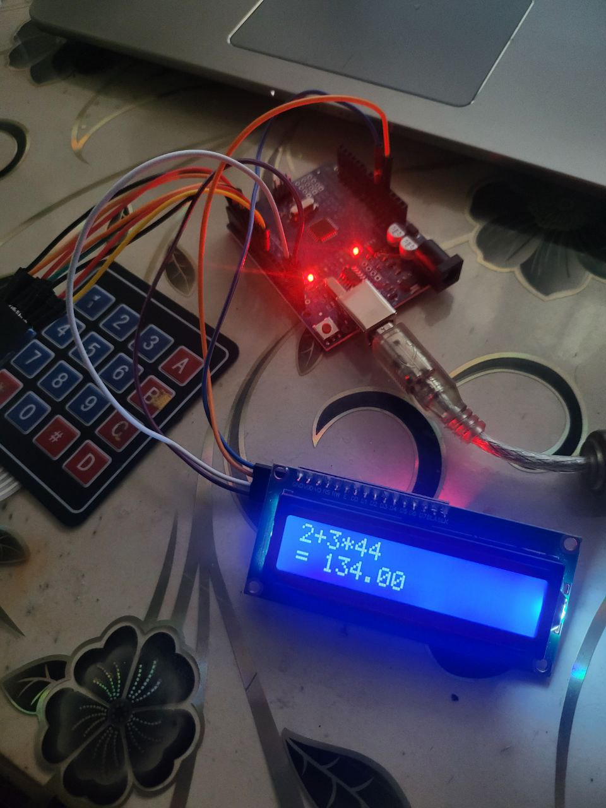
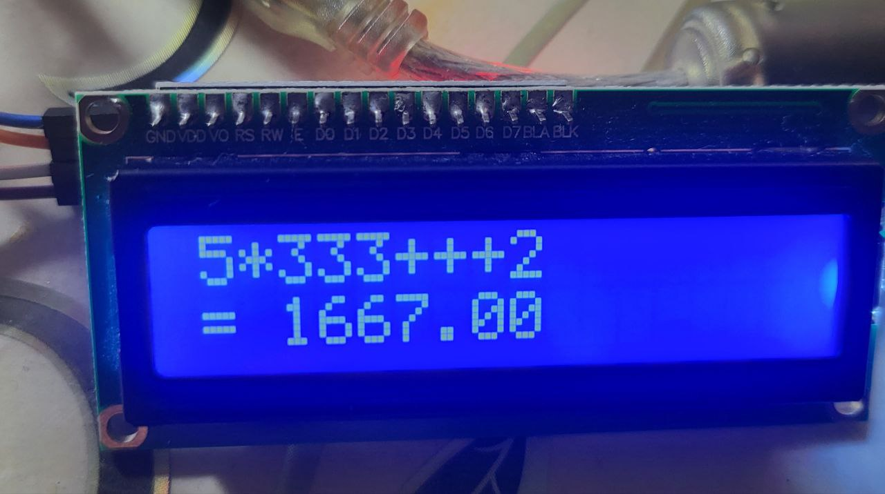
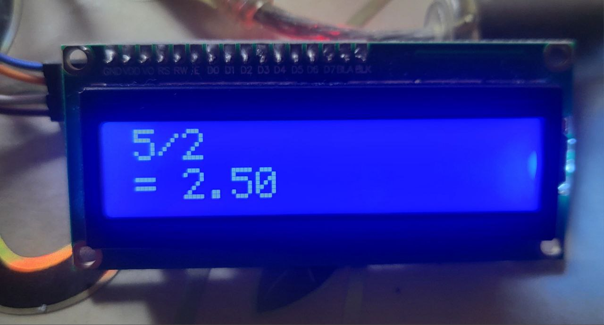
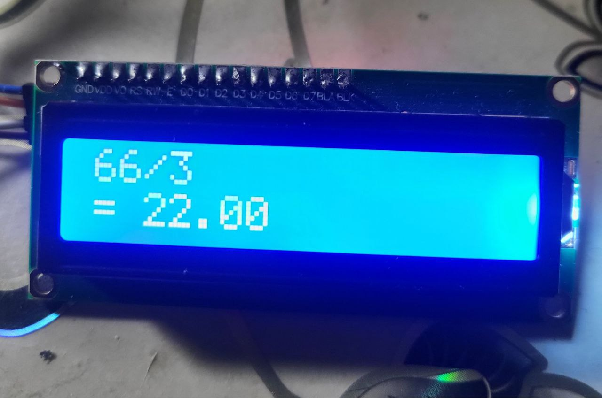
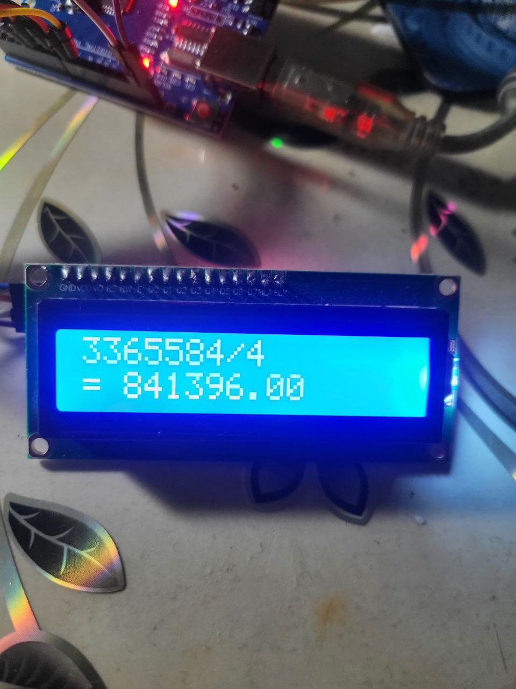

## https://youtu.be/vPYxPwWhWqY?si=7Nre34xZXnXm2o9M youtube link testing
# Arduino Calculator

## Project Description

This is a mini-calculator built using Arduino that supports basic mathematical operations. The calculator includes an LCD display and a 4x4 keypad and can handle expressions with operator precedence (`+`, `-`, `*`, `/`). The device is capable of operating independently from battery power, making it portable and practical.


## Objectives

- Develop a working calculator on the Arduino platform
- Support operator precedence for arithmetic expressions
- Provide a user interface through LCD and Keypad
- Dynamically evaluate user-entered expressions


## Key Features

- [x] Supports arithmetic operations: `+`, `-`, `*`, `/`
- [x] Handles operator precedence (`*` and `/` take precedence over `+` and `-`)
- [x] Clear input functionality using the `C` button
- [x] Displays the current expression and final result
- [x] User interface via LCD and 4x4 Keypad
- [x] Modular and structured code


## Sample Expressions

| Input             | Result  |
|------------------|---------|
| `2+3*4`          | `14`    |
| `25/5   `        | `5 `    |
| `1+2+3+4+5`      | `15`    |
| `5*3+2  `        | `17`    |


## Hardware Components

- Arduino Uno 
- 16x2 LCD Display (I2C interface)
- 4x4 Matrix Keypad
- Jumper Wires


##Examples







## Code Structure

```cpp
void loop() { ... }                    // Main program loop
evaluate()                            // Evaluates entire expression
processMulDiv() / processAddSub()     // Handles operator precedence
findStart() / findEnd()               // Locates numbers within the expression


